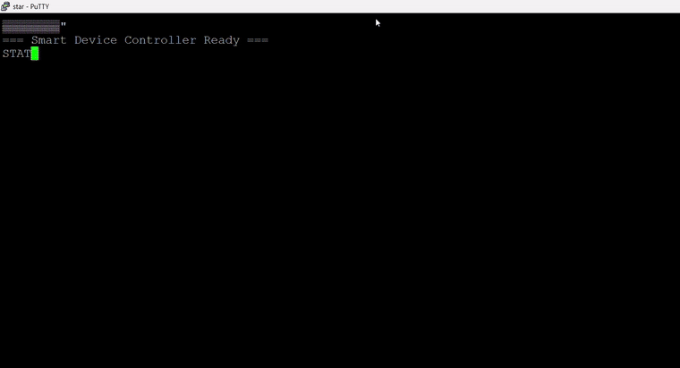

# STM32 Smart Device Controller (Blue Pill, FreeRTOS, Renode-Simulated)

A bare-metal-style embedded firmware project for the STM32F103C8T6 ("Blue Pill"),
built entirely without physical hardware and validated end-to-end using the
[Renode](https://renode.io) hardware simulation framework.

The firmware implements a simple smart device controller: it simulates a sensor
reading on a periodic hardware timer interrupt, runs an automatic threshold-based
control loop driving simulated actuator outputs, and exposes a UART command
interface for manual override and status reporting — all running on FreeRTOS
with two cooperating tasks.

## Demo



*Live session in Renode's simulated STM32F103, showing `STATUS`, `MODE MANUAL`,
and manual actuator control over the UART command interface — no physical
hardware involved.*

## Why simulation?

I don't currently own a physical Blue Pill board. Rather than wait on hardware,
I built and validated this firmware entirely in [Renode](https://renode.io),
an open-source hardware simulation framework used in real embedded engineering
teams for hardware-in-the-loop-free firmware testing and CI. The `.elf` built
here is standard STM32 HAL/CMSIS code — it would run unmodified on real Blue
Pill hardware.

## Architecture

- **MCU target:** STM32F103C8T6 (64KB flash / 20KB RAM, Cortex-M3 @ 8MHz)
- **RTOS:** FreeRTOS (CMSIS_V2 interface), two tasks + one queue
  - `SensorTask` — woken by a 1Hz TIM2 hardware interrupt; updates a simulated
    temperature reading, runs the AUTO-mode control logic (fan/heater GPIO
    outputs, critical-temp alarm LED), and pushes a status snapshot into
    `sensorQueue`
  - `UartTask` — woken by USART1 RX interrupts; parses line-based commands and
    responds over UART; reads the latest snapshot from `sensorQueue` to answer
    `STATUS`
- **Peripherals used:** GPIO (output actuators + onboard LED), USART1
  (interrupt-driven RX/TX), TIM2 (periodic interrupt)

### Command interface (115200 8N1 over USART1)

| Command | Effect |
|---|---|
| `STATUS` | Reports current temperature, mode, and actuator states |
| `MODE AUTO` | Switches to automatic threshold-based control |
| `MODE MANUAL` | Switches to manual control (required before `SET PAx`) |
| `SET THRESHOLD n` | Sets the fan-trigger temperature threshold |
| `SET PA0 ON`/`OFF` | Manually drives the fan output (manual mode only) |
| `SET PA1 ON`/`OFF` | Manually drives the heater output (manual mode only) |
| `SET PA2 ON`/`OFF` | Manually drives the auxiliary alarm output (manual mode only) |

## Repository layout

```
firmware/     STM32CubeIDE project (Core/, Drivers/, Middlewares/, .ioc file)
sim/          Renode simulation script (simulate.resc)
```

## Building

1. Open `firmware/` as an existing project in STM32CubeIDE
2. Build (Project → Build Project) — produces `firmware/Debug/STM32_Smart_Device_Controller_C.elf`

## Running in simulation (no hardware required)

1. Install [Renode](https://renode.io)
2. Edit the `$bin` path in `sim/simulate.resc` to point at your built `.elf`
3. From the `sim/` folder: `renode simulate.resc`
4. Connect a raw TCP terminal (e.g. [PuTTY](https://putty.org) in **Raw** mode,
   not Telnet) to `localhost:3456` to interact with the UART command interface

## Known limitations / simulation notes

- **HSE/PLL clock path is not usable in Renode**: Renode's STM32F103 platform
  model does not implement the RCC peripheral's oscillator-ready behavior, which
  causes the standard 72MHz HSE+PLL clock configuration to hang indefinitely
  waiting on a status flag that never legitimately clears. This firmware runs
  on the internal 8MHz HSI oscillator instead (`PLLState = RCC_PLL_NONE`) —
  functionally correct for this project, but a difference from how a
  performance-oriented real deployment would typically be clocked.
- **UART command parsing uses a FreeRTOS message queue of complete lines**
  (`uartLineQueue`), not a shared buffer — this replaced an earlier v1 design
  that used a single shared buffer plus a flag, which had a genuine race
  condition: a line could be overwritten before `UartTask` finished processing
  it. The queue-based design was verified against the same burst-command
  scenario that broke the v1 design, with zero dropped/corrupted commands
  under realistic (one-at-a-time) usage.
  - **Known remaining edge case**: pasting many commands into the terminal
    *simultaneously* (rather than typing them) can still exceed the queue's
    4-slot depth, since Renode's raw socket terminal delivers bytes far
    faster than real UART hardware would (real hardware's ~87us/byte pacing
    at 115200 baud naturally gives the consumer task time to keep up; this
    simulation bypasses that pacing entirely). This is arguably more a
    Renode simulation artifact than a firmware bug, but increasing
    `uartLineQueue`'s depth would add headroom either way.
- **`STATUS` reports a periodic snapshot, not live state.** The sensor/actuator
  status shown by `STATUS` is captured once per second by `SensorTask` (on
  each TIM2 tick) and read back from `sensorQueue`. A `MODE`/`SET` command
  issued and then immediately followed by `STATUS` within the same ~1-second
  window can report the state from just before the change, since the next
  snapshot hasn't been captured yet. This is a deliberate tradeoff (decoupling
  reporting cadence from command handling) rather than a bug, but worth being
  aware of when testing.
- **HAL timebase uses SysTick** (rather than a dedicated timer) despite running
  FreeRTOS, which normally also wants SysTick for its own scheduler tick. This
  is the standard, most common STM32+FreeRTOS configuration and works safely
  here since CubeMX's generated `SysTick_Handler` correctly services both
  HAL and the RTOS tick — a dedicated-timer alternative was tested but found
  to be unreliable under Renode's Blue Pill timer model.

## Next steps

- Increase `uartLineQueue` depth (or add basic flow control) to handle
  simultaneous-paste command bursts, not just realistic one-at-a-time typing
- Add a hardware abstraction seam so the same application logic could
  target real HSE/PLL clocking on physical hardware while still simulating
  cleanly on HSI in Renode
